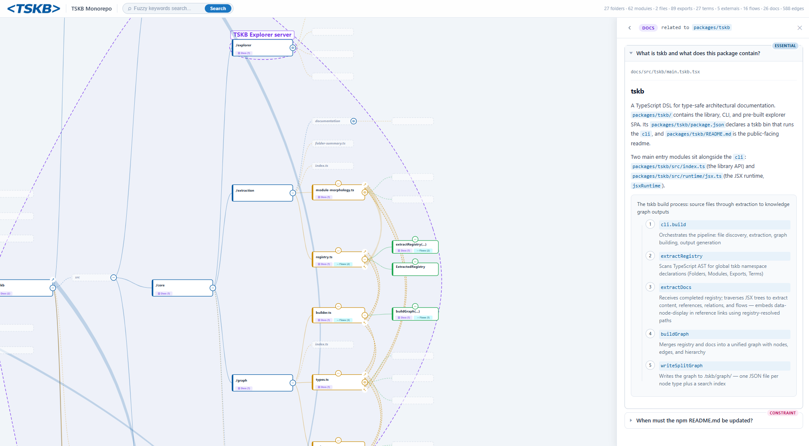

# tskb

**A typed, compiler-validated knowledge graph for TypeScript codebases — authored in `.tskb.tsx` files, queryable from the CLI, explorable in the browser.**

[](https://www.npmjs.com/package/tskb)
[](https://opensource.org/licenses/MIT)

> **Your AI assistant authors the docs. You navigate them.**



🔗 **Live demo:** [tskb's own graph](https://tskb-static-b3hqdl4xbq-ew.a.run.app/) · 🎬 [Explorer walkthrough video](./references/tskb-explorer-video.webm)

---

## Why tskb

- **Refactor-proof.** Docs reference real code via `typeof import()`. Rename a function and the docs build fails — stale docs surface as a build error, not silent drift.
- **AI authors, humans navigate.** `.tskb.tsx` files are written by AI assistants during normal engineering work. You read the result in the explorer or query it from the CLI.
- **One graph across teams.** Registry blocks in every file merge into one `tskb` namespace. No central manifest — each team documents its slice next to its code, the type system stitches it together.
- **Queryable architecture.** A typed graph of folders, modules, exports, flows, and decisions — not a wiki. Search, traverse, and inspect from the CLI or browser.

---

## A taste

A `.tskb.tsx` file answers one question, with type-checked references to real code:

```tsx
import type { Module, Export } from "tskb";
import { Doc, P, ref } from "tskb";

declare global {
  namespace tskb {
    interface Modules {
      "auth.service": Module<{
        desc: "Issues and validates session tokens";
        type: typeof import("../src/auth/service.js");
      }>;
    }
    interface Exports {
      "auth.service.login": Export<{
        desc: "Validates credentials and returns a signed JWT";
        type: typeof import("../src/auth/service.js").login;
      }>;
    }
  }
}

const Login = ref as tskb.Exports["auth.service.login"];

export default (
  <Doc explains="How does login issue a session token?" priority="essential">
    <P>{Login} signs a short-lived JWT and returns it as an HttpOnly cookie.</P>
  </Doc>
);
```

Rename `login` in `service.ts` → `tskb build` fails. The doc can't drift past its referent.

👉 **Full authoring guide, CLI reference, and AI assistant integration:** [packages/tskb/README.md](./packages/tskb/README.md)

---

## Quick start

```bash
npm install --save-dev tskb

npx --no -- tskb init       # scaffold docs/, tsconfig, starter file, and an npm script
npm run docs                # build the knowledge graph
npx --no -- tskb explore    # open the visual explorer
```

---

## This repository

This is the tskb monorepo. If you're here to **use** tskb, you want the [package README](./packages/tskb/README.md). The sections below are for contributing to tskb itself.

### Workspace

```
tskb/
├── packages/tskb/   # the published npm package (CLI, runtime, explorer)
├── docs/            # tskb documenting itself (meta)
├── references/      # screenshots and example graphs used in docs
└── tests/           # e2e tests for the CLI
```

### Prerequisites

- Node.js >= 20.0.0
- npm >= 10.0.0

### Scripts

```bash
npm install          # installs deps, builds the package, builds the meta docs
npm run build        # build all workspace packages
npm run build:docs   # rebuild the tskb graph for this repo
npm run format       # format with Prettier
npm run format:check # check formatting
npm run clean        # remove build outputs and node_modules
```

---

## License

MIT © Dimitar Mihaylov
