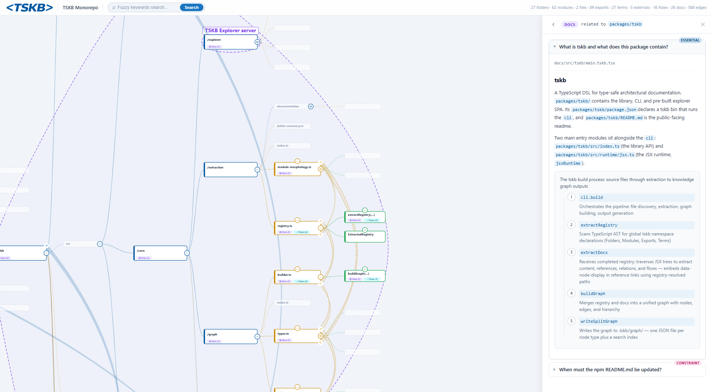

# tskb monorepo

Two TypeScript tools that work together: one describes what your codebase **is**, the other runs what it's **doing**. Both are written so that humans and AI assistants can work from the same source of truth.

| Package                       | What it is                                                                                                                                                                | Docs                                                   |
| ----------------------------- | ------------------------------------------------------------------------------------------------------------------------------------------------------------------------- | ------------------------------------------------------ |
| [**tskb**](./packages/tskb)   | The **knowledge layer**. A typed, compiler-checked knowledge graph of your architecture, written in `.tskb.tsx` files, queryable from the CLI, explorable in the browser. | [packages/tskb/README.md](./packages/tskb/README.md)   |
| [**omkit**](./packages/omkit) | The **operational layer**. Dev workflows (start servers, wait for health, drive a browser, tear it all down) written as TypeScript, with each run recorded to disk.       | [packages/omkit/README.md](./packages/omkit/README.md) |

This repo uses both on itself: tskb documents the repo in [docs/](./docs), and omkit runs its dev stack from [om/](./om).

---

## tskb: the knowledge layer

[](https://www.npmjs.com/package/tskb)

> **Your AI assistant authors the docs. You navigate them.**



🔗 **Live demo:** [tskb's own graph](https://tskb-static-b3hqdl4xbq-ew.a.run.app/) · 🎬 [Explorer walkthrough video](./references/tskb-explorer-video.webm)

- **Refactor-proof.** Docs reference real code via `typeof import()`. Rename a function and the docs build fails, so stale docs show up as a build error instead of drifting silently.
- **AI authors, humans navigate.** AI assistants write `.tskb.tsx` files during normal engineering work. You read the result in the explorer or query it from the CLI.
- **One graph across teams.** Every file's registry merges into one `tskb` namespace. There's no central manifest, and the type system connects the pieces.

```tsx
const Login = ref as tskb.Exports["auth.service.login"];

export default (
  <Doc explains="How does login issue a session token?" priority="essential">
    <P>{Login} signs a short-lived JWT and returns it as an HttpOnly cookie.</P>
  </Doc>
);
```

```bash
npm install --save-dev tskb
npx --no -- tskb init       # scaffold docs/, tsconfig, a starter file, and an npm script
npm run docs                # build the knowledge graph
npx --no -- tskb explore    # open the visual explorer
```

👉 **Authoring guide, CLI reference, and AI assistant integration:** [packages/tskb/README.md](./packages/tskb/README.md)

---

## omkit: the operational layer

[](https://www.npmjs.com/package/omkit)

> **Humans orchestrate. Runs narrate. AI assistants follow along.**

- **Workflows are plain TypeScript.** You write `await`, `if`, and loops instead of YAML or `concurrently` + `wait-on` + shell glue.
- **Steps pass typed values to each other.** For example, a live browser page or a port, rather than strings scraped from stdout.
- **Every run is recorded.** Each run gets a folder with `result.json`, per-step logs, and a verdict. A human or an assistant can check what actually happened instead of guessing.
- **Works over MCP.** Assistants can list, start, poll, and stop your workflows directly.

```ts
om("dev").run(async () => {
  command("npm run dev", { cwd: "api" }).tag("api");
  await healthcheck({ url: "http://localhost:3000" }).result; // wait until it actually serves
  const page = chromePage("app", await browser().ref, { url: "http://localhost:3000" });
});
```

👉 **Concepts and API:** [packages/omkit/README.md](./packages/omkit/README.md)
👉 **How this repo uses it (dev stack, arguments, logs, MCP):** [om/README.md](./om/README.md)

---

## Working on this repo

### Prerequisites

- Node.js >= 20
- npm >= 10
- Google Chrome (the dev stack opens the explorer in it)

### Get it running

```bash
git clone https://github.com/mitk0936/tskb.git
cd tskb
npm install    # installs deps, builds both packages, builds this repo's knowledge graph
npm run dev    # starts the dev stack
```

`npm run dev` runs the **`tskb:dev`** omkit workflow. It:

1. asks **`Run tests?`** (defaults to `no` after 10 seconds),
2. starts the docs watcher, the tskb library watcher, and the explorer's dev server,
3. waits until the explorer actually responds at http://localhost:9876/,
4. opens Chrome on it and checks that the page rendered,
5. prints `Platform running.` Edit code and everything rebuilds. Press **Ctrl+C** to stop all of it.

Every run is logged to `om/logs/tskb-dev-<hash>/<date>/<time>/`. If something fails, check `result.json` there first.

To skip the prompt or change ports, pass arguments as JSON:

```bash
OMKIT_ARGS='{"runTests":false,"headless":true}' npm run dev
```

📖 **Full guide** (every workflow and argument, the interactive picker, reading run logs, letting Claude drive the stack over MCP, adding your own workflow, troubleshooting): **[om/README.md](./om/README.md)**

### Workspace

```
tskb/
├── packages/
│   ├── tskb/        # tskb, the published npm package (CLI, runtime, explorer)
│   └── omkit/       # omkit, the published npm package (runtime, actions, CLI, MCP server)
├── om/              # this repo's omkit workflows: tskb:dev, tskb:build, page:drive
├── docs/            # tskb documenting this repo (.tskb.tsx)
├── references/      # screenshots and example graphs used in docs
├── tests/           # e2e tests for the tskb CLI
└── .mcp.json        # registers the omkit MCP server for Claude Code
```

### Scripts

Run these from the repo root.

```bash
npm install          # install deps, build all packages, build the knowledge graph
npm run dev          # start the dev stack (omkit: tskb:dev)
npm run build        # build all workspace packages + the knowledge graph
npm run build:docs   # rebuild the tskb graph for this repo (+ regenerate skill files)
npm test             # run the unit tests (vitest)
npm run lint         # lint all packages and docs
npm run format       # format with Prettier
npm run mcp          # serve the omkit workflows over MCP (stdio)
npm run clean        # remove build outputs, node_modules, and logs
```

### AI assistants

The repo is set up for Claude Code. It includes generated skills in [.claude/skills/](./.claude/skills): `tskb-toc`/`tskb` for navigating the architecture graph and `omkit-runs` for the runnable workflows. [.mcp.json](./.mcp.json) connects the omkit MCP server. The skills are regenerated by `npm run build:docs`, so don't edit them by hand.

---

## License

MIT © Dimitar Mihaylov
